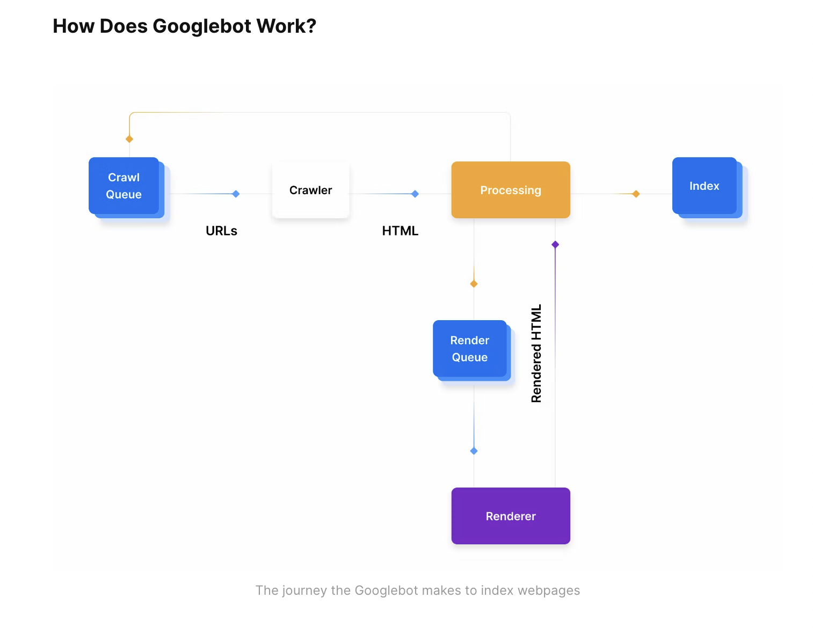

Note

1. Nextjs: React framework for production

- still write react code,components, features
- built in feature (routing)

2. By default, Next.js pre-renders every page. This means that Next.js generates HTML for each page in advance, instead of having it all done by client-side JavaScript. Pre-rendering can result in better performance and SEO.

3. SEO
   
